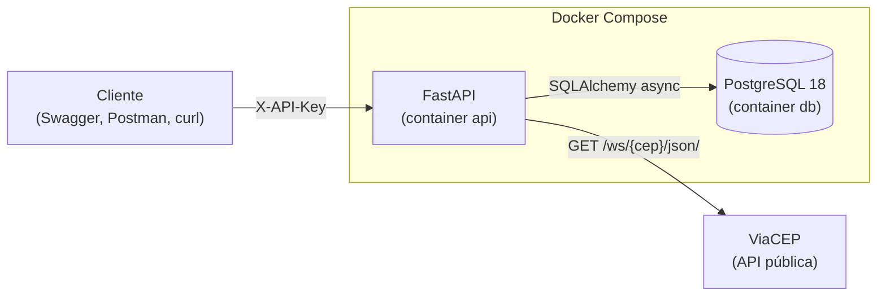

# API de Endereços — Desafio Técnico ViaCEP

[](https://github.com/caarlosandree/desafio-tecnico-viacep/actions/workflows/ci.yml)


[](LICENSE)

API REST que **extrai endereços da API pública [ViaCEP](https://viacep.com.br)**, **armazena no PostgreSQL** e **disponibiliza os dados para consulta remota**, com documentação Swagger e ambiente completo em Docker.

| Requisito do desafio | Como foi atendido |
|---|---|
| Extração via API com parâmetros dinâmicos | `GET https://viacep.com.br/ws/{cep}/json/`, com o CEP informado na rota da API |
| Autenticação com chave de API | Header `X-API-Key` exigido nas rotas de endereços (veja [Autenticação](#autenticação)) |
| Armazenamento em banco relacional | PostgreSQL 18, tabela `enderecos` versionada com migrations (Alembic) |
| API REST para consulta | FastAPI com Swagger em `/docs`, collection do Postman e arquivo `.http` |
| Docker | `docker compose up` sobe a API e o banco, e aplica as migrations automaticamente |
| Git e documentação | Commits no padrão Conventional Commits e este README |

---

## Sumário

- [Arquitetura](#arquitetura)
- [Como executar (Docker)](#como-executar-docker)
- [Autenticação](#autenticação)
- [Endpoints](#endpoints)
- [Acessando os dados remotamente](#acessando-os-dados-remotamente)
- [Modelo de dados](#modelo-de-dados)
- [Variáveis de ambiente](#variáveis-de-ambiente)
- [Desenvolvimento local (sem Docker)](#desenvolvimento-local-sem-docker)
- [Testes e qualidade](#testes-e-qualidade)
- [Decisões técnicas](#decisões-técnicas)
- [CI e fluxo de contribuição](#ci-e-fluxo-de-contribuição)
- [Licença](#licença)
- [Solução de problemas](#solução-de-problemas)

---

## Arquitetura



Fluxo de um `POST /api/v1/enderecos/{cep}`:

1. **Rota:** valida a chave de API e recebe o CEP, com ou sem hífen.
2. **Serviço:** normaliza o CEP e pede os dados ao cliente ViaCEP.
3. **Cliente ViaCEP:** faz a requisição HTTP e converte timeouts e respostas de erro em exceções de domínio.
4. **Serviço:** grava o endereço com **upsert** (`INSERT ... ON CONFLICT (cep) DO UPDATE`), então um CEP repetido é atualizado em vez de duplicado.
5. **Resposta:** a rota devolve o registro salvo. Os erros viram respostas HTTP padronizadas: 404, 422 ou 502.

### Stack

- **Linguagem:** Python 3.14
- **API:** FastAPI + Uvicorn
- **HTTP:** httpx (assíncrono)
- **Banco:** SQLAlchemy 2 (async) + psycopg 3, PostgreSQL 18
- **Migrations:** Alembic
- **Configuração:** pydantic-settings
- **Testes e lint:** pytest + ruff
- **Contêineres:** Docker Compose

### Estrutura do projeto

```
.
├── app/
│   ├── api/
│   │   ├── dependencies.py    # injeção de sessão, cliente ViaCEP e serviço
│   │   ├── errors.py          # exceções de domínio → respostas HTTP
│   │   └── routes/            # enderecos.py, health.py
│   ├── clients/               # viacep.py (cliente HTTP) e exceptions.py
│   ├── core/                  # config.py (settings), security.py (API key)
│   ├── db/                    # base.py (Base ORM), session.py (engine/sessão)
│   ├── models/                # endereco.py (tabela enderecos)
│   ├── schemas/               # modelos Pydantic de entrada/saída
│   ├── services/              # endereco_service.py (regras de negócio)
│   └── main.py                # criação da aplicação FastAPI
├── migrations/                # Alembic (versions/ contém as migrations)
├── tests/                     # testes unitários e de integração
├── docs/postman/              # collection do Postman
├── scripts/start.sh           # aplica migrations e inicia a API (container)
├── .github/                   # CI, Dependabot, templates de PR e issues
├── pyproject.toml             # configuração do ruff, pytest e coverage
├── Dockerfile
├── docker-compose.yml
├── test_main.http             # requisições para o HTTP Client do PyCharm
├── requirements.txt           # dependências da aplicação
└── requirements-dev.txt       # + dependências de desenvolvimento
```

---

## Como executar (Docker)

**Pré-requisito:** Docker com o Compose v2.

1. **Clone o repositório e entre na pasta:**
   ```bash
   git clone https://github.com/caarlosandree/desafio-tecnico-viacep.git
   ```
   ```bash
   cd desafio-tecnico-viacep
   ```

2. **Crie o arquivo `.env`** a partir do exemplo:
   ```bash
   cp .env.example .env
   ```
   Depois **defina uma chave própria** em `API_KEY`. Para gerar uma:
   ```bash
   python3 -c "import secrets; print(secrets.token_urlsafe(32))"
   ```

3. **Suba o ambiente:**
   ```bash
   docker compose up -d --build
   ```
   O Compose faz o seguinte:
   - espera o PostgreSQL ficar saudável;
   - aplica as migrations (`alembic upgrade head`);
   - inicia a API na porta **8000**.

4. **Confira se está no ar:**
   ```bash
   curl http://localhost:8000/health
   ```
   A resposta esperada é `{"status":"ok","banco":"ok"}`.

5. **Abra o Swagger:** http://localhost:8000/docs

Para ver os logs da API:

```bash
docker compose logs -f api
```

Para parar os serviços, mantendo os dados:

```bash
docker compose down
```

Para parar e **apagar os dados** do banco:

```bash
docker compose down -v
```

---

## Autenticação

As rotas de `/api/v1/enderecos` exigem o header:

```
X-API-Key: <valor de API_KEY no .env>
```

- **Sem a chave, ou com uma chave errada:** a API responde `401` com `{"detail": "Chave de API ausente ou inválida."}`.
- **Rotas públicas:** `/health` (usada pelo healthcheck do Docker), `/docs` e `/openapi.json`.
- **No Swagger:** clique em **Authorize** e informe a chave.

> **Por que a chave protege a nossa API, e não a chamada ao ViaCEP?**
> O ViaCEP é uma API aberta e **não usa chave de acesso**. Para atender ao requisito de autenticação por chave, a autenticação foi aplicada na API construída neste projeto, que é quem expõe os dados armazenados. A comparação da chave usa `secrets.compare_digest`, para o tempo de resposta não revelar parte da chave. Na configuração, a chave é um `SecretStr`, para não aparecer em logs.

---

## Endpoints

Base: `http://localhost:8000`

| Método | Rota | Descrição | Sucesso | Erros |
|---|---|---|---|---|
| `GET` | `/health` | Verifica a API e a conexão com o banco | 200 | 503 |
| `POST` | `/api/v1/enderecos/{cep}` | Extrai o endereço do ViaCEP e salva (upsert) | 201 (novo), 200 (atualizado) | 401, 404, 422, 502 |
| `GET` | `/api/v1/enderecos` | Lista os endereços salvos, com filtros e paginação | 200 | 401, 422 |
| `GET` | `/api/v1/enderecos/{cep}` | Consulta um endereço salvo (não chama o ViaCEP) | 200 | 401, 404, 422 |
| `DELETE` | `/api/v1/enderecos/{cep}` | Remove um endereço salvo | 204 | 401, 404, 422 |

**Parâmetros de `GET /api/v1/enderecos`:**

| Parâmetro | Tipo | Padrão | Regra |
|---|---|---|---|
| `uf` | string | — | 2 letras; não diferencia maiúsculas de minúsculas |
| `localidade` | string | — | 2 a 120 caracteres; busca por parte do nome, sem diferenciar maiúsculas de minúsculas |
| `limit` | int | 20 | de 1 a 100 |
| `offset` | int | 0 | ≥ 0 |

**Significado dos erros:**

| Status | Quando acontece |
|---|---|
| `401` | Chave de API ausente ou inválida |
| `404` | CEP não existe no ViaCEP (`POST`) ou não está na base (`GET` e `DELETE`) |
| `422` | CEP sem 8 dígitos, ou parâmetro de consulta inválido |
| `502` | ViaCEP fora do ar, lento (timeout) ou com resposta inesperada |

Os erros seguem o formato `{"detail": "mensagem"}`.

---

## Acessando os dados remotamente

Os exemplos abaixo usam a variável `API_KEY`. Para carregá-la a partir do `.env`, no bash ou zsh:

```bash
export API_KEY=$(grep '^API_KEY=' .env | cut -d= -f2-)
```

No fish:

```bash
set -x API_KEY (grep '^API_KEY=' .env | cut -d= -f2-)
```

### curl

**Extrair e salvar um endereço:**

```bash
curl -X POST http://localhost:8000/api/v1/enderecos/01001-000 -H "X-API-Key: $API_KEY"
```

Resposta (`201`):

```json
{
  "id": 1,
  "cep": "01001000",
  "logradouro": "Praça da Sé",
  "complemento": "lado ímpar",
  "bairro": "Sé",
  "localidade": "São Paulo",
  "uf": "SP",
  "ibge": "3550308",
  "ddd": "11",
  "created_at": "2026-09-17T15:17:20.193032Z",
  "updated_at": "2026-09-17T15:17:20.193032Z"
}
```

**Listar os endereços de SP, com paginação:**

```bash
curl "http://localhost:8000/api/v1/enderecos?uf=SP&limit=10&offset=0" -H "X-API-Key: $API_KEY"
```

Resposta (`200`):

```json
{ "items": [ { "id": 1, "cep": "01001000", "...": "..." } ], "total": 1, "limit": 10, "offset": 0 }
```

**Consultar um endereço salvo:**

```bash
curl http://localhost:8000/api/v1/enderecos/01001000 -H "X-API-Key: $API_KEY"
```

**Remover um endereço salvo:**

```bash
curl -X DELETE http://localhost:8000/api/v1/enderecos/01001000 -H "X-API-Key: $API_KEY"
```

### Swagger

Acesse http://localhost:8000/docs, clique em **Authorize**, informe a chave e use **Try it out** em cada rota. A especificação OpenAPI fica em http://localhost:8000/openapi.json.

### Postman

1. Importe o arquivo [`docs/postman/desafio-viacep.postman_collection.json`](docs/postman/desafio-viacep.postman_collection.json).
2. Em *Variables*, defina `apiKey` com o valor da sua chave. A variável `baseUrl` vem como `http://localhost:8000`.
3. Use **Run collection**.

As pastas estão na ordem de execução e cada requisição tem testes automáticos: são 17 requisições e 31 verificações. A execução remove os CEPs que importa.

Para rodar pelo terminal com o [Newman](https://github.com/postmanlabs/newman):

```bash
npx newman run docs/postman/desafio-viacep.postman_collection.json --env-var "apiKey=$API_KEY"
```

### HTTP Client do PyCharm

O arquivo [`test_main.http`](test_main.http) tem uma requisição para cada cenário. As variáveis vêm de dois arquivos:
- [`http-client.env.json`](http-client.env.json) (versionado), com o `baseUrl`;
- `http-client.private.env.json` (fora do Git), com a chave. Crie esse arquivo com o conteúdo abaixo:

```json
{ "dev": { "apiKey": "<valor de API_KEY do .env>" } }
```

Depois, selecione o ambiente **dev** no editor.

---

## Modelo de dados

Tabela **`enderecos`**, criada pela migration em [`migrations/versions/`](migrations/versions/):

| Coluna | Tipo | Restrições |
|---|---|---|
| `id` | `integer` | PK |
| `cep` | `char(8)` | `NOT NULL`, **único**, `CHECK (cep ~ '^[0-9]{8}$')` |
| `logradouro` | `varchar(255)` | `NOT NULL`, padrão `''` |
| `complemento` | `varchar(255)` | `NOT NULL`, padrão `''` |
| `bairro` | `varchar(120)` | `NOT NULL`, padrão `''` |
| `localidade` | `varchar(120)` | `NOT NULL` |
| `uf` | `char(2)` | `NOT NULL`, `CHECK (uf ~ '^[A-Z]{2}$')` |
| `ibge` | `varchar(7)` | `NOT NULL`, padrão `''` |
| `ddd` | `varchar(2)` | `NOT NULL`, padrão `''` |
| `created_at` | `timestamptz` | `NOT NULL`, padrão `now()` |
| `updated_at` | `timestamptz` | `NOT NULL`, padrão `now()`, atualizada no upsert |

**Índices:**
- `pk_enderecos` (`id`)
- `uq_enderecos_cep` (`cep`), que sustenta o upsert
- `ix_enderecos_uf_localidade` (`uf`, `localidade`), para os filtros da listagem

**Decisões de modelagem:**
- **CEP como texto:** o CEP é guardado **só com dígitos** e como texto, não como número, porque o zero à esquerda é significativo (`01001000`).
- **Campos opcionais sem `NULL`:** os campos que o ViaCEP pode devolver vazios usam `''` como padrão, então a API nunca retorna `null` para eles.
- **Validação também no banco:** as `CHECK constraints` garantem a integridade mesmo em inserções feitas fora da API.

Para inspecionar a tabela:

```bash
docker compose exec db psql -U postgres -d enderecos -c '\d enderecos'
```

---

## Variáveis de ambiente

Definidas no `.env` (modelo em [`.env.example`](.env.example)):

| Variável | Obrigatória | Padrão | Uso |
|---|---|---|---|
| `API_KEY` | **sim** | — | Chave exigida no header `X-API-Key` |
| `DATABASE_URL` | sim, fora do Docker | — | URL do banco usada ao rodar a API localmente. No Compose, ela é montada a partir das variáveis `POSTGRES_*`, com o host `db` |
| `APP_NAME` | não | `API de Endereços` | Título exibido no Swagger |
| `VIACEP_BASE_URL` | não | `https://viacep.com.br/ws` | URL base do ViaCEP |
| `HTTP_TIMEOUT` | não | `3` | Timeout, em segundos, de **cada** chamada ao ViaCEP |
| `VIACEP_TENTATIVAS` | não | `3` | Tentativas por consulta ao ViaCEP (1 desliga a repetição; máximo 5) |
| `VIACEP_BACKOFF_INICIAL` | não | `0.2` | Espera, em segundos, antes de repetir; dobra a cada tentativa |
| `POSTGRES_USER` / `POSTGRES_PASSWORD` / `POSTGRES_DB` | não | `postgres` / `postgres` / `enderecos` | Credenciais do container do banco |
| `API_PORT` | não | `8000` | Porta da API na máquina |
| `POSTGRES_PORT` | não | `5432` | Porta do banco na máquina |
| `TEST_DATABASE_URL` | não | banco `<nome>_test` | Banco usado pelos testes |

Sem `API_KEY`, o `docker compose up` falha com a mensagem *"defina API_KEY no arquivo .env"*.

---

## Desenvolvimento local (sem Docker)

A API roda na sua máquina e só o banco fica no Docker.

1. **Crie o ambiente virtual.** No bash ou zsh:
   ```bash
   python3 -m venv .venv && source .venv/bin/activate
   ```
   No fish, use `source .venv/bin/activate.fish`.

2. **Instale as dependências:**
   ```bash
   pip install -r requirements-dev.txt
   ```

3. **Suba só o banco:**
   ```bash
   docker compose up -d --wait db
   ```

4. **Aplique as migrations:**
   ```bash
   alembic upgrade head
   ```

5. **Inicie a API com reload:**
   ```bash
   uvicorn app.main:app --reload
   ```

Para criar uma nova migration depois de alterar um model, gere-a com o comando abaixo e **revise o arquivo gerado** antes de aplicar:

```bash
alembic revision --autogenerate -m "descricao da mudanca"
```

---

## Testes e qualidade

Os testes usam **um banco separado** (`enderecos_test`), criado automaticamente no mesmo PostgreSQL. Cada teste roda dentro de uma transação que é desfeita ao final, então **os dados de desenvolvimento nunca são afetados**. O ViaCEP é sempre simulado, e os testes não acessam a internet.

Com o banco de pé (`docker compose up -d --wait db`), rode os testes:

```bash
pytest -v
```

Para ver a cobertura:

```bash
pytest --cov=app --cov-report=term-missing
```

Para rodar o linter:

```bash
ruff check .
```

Para verificar a formatação:

```bash
ruff format --check .
```

**Situação atual:** 62 testes passando e **94% de cobertura**.

| Arquivo | O que cobre |
|---|---|
| `tests/test_viacep_client.py` | Normalização do CEP e cliente HTTP, com `httpx.MockTransport`: sucesso, CEP inexistente, timeout, erro de conexão, status 4xx/5xx, JSON inválido e resposta incompleta |
| `tests/test_endereco_service.py` | Upsert sem duplicação, atualização de dados, filtros, busca tratando `%` como texto, paginação e remoção, com PostgreSQL real |
| `tests/test_api.py` | Todos os endpoints e códigos HTTP, autenticação (401 em cada rota protegida), health check e documentação OpenAPI |

Sem o banco disponível, os testes que dependem dele são marcados como *skipped* em vez de falhar.

---

## Decisões técnicas

- **Camadas separadas (rota → serviço → cliente/banco):** as rotas não conhecem HTTP externo nem SQL. O serviço recebe suas dependências por injeção, o que permite testá-lo com um ViaCEP falso.
- **Tudo assíncrono:** como o FastAPI, o httpx e o SQLAlchemy usam `async`, a espera pelo ViaCEP ou pelo banco não bloqueia outras requisições. Um único `httpx.AsyncClient` é compartilhado pela aplicação, criado no `lifespan`.
- **Upsert atômico:** um único `INSERT ... ON CONFLICT` evita a condição de corrida de "consultar e depois inserir" e garante um registro por CEP.
- **Idempotência com chave natural:** o CEP é a chave de deduplicação — `POST` repetido atualiza o registro e responde `200` em vez de `201` (detectado via `xmax` no `RETURNING`), e `DELETE` repetido retorna `404` sem alterar o estado, informando ao cliente que o recurso já não existia.
- **Retentativas só para falhas temporárias:** uma consulta ao ViaCEP é repetida até 3 vezes, com espera que dobra a cada tentativa (0,2s e depois 0,4s), quando a falha é timeout, erro de rede ou status `429`/`5xx`. Erros `4xx`, respostas malformadas e CEP inexistente falham de imediato — repeti-los não mudaria o resultado e só atrasaria a resposta. Como o pior caso soma os timeouts de todas as tentativas, o `HTTP_TIMEOUT` padrão é 3s: 3 × 3s + 0,6s de espera ≈ 9,6s no limite. A espera é determinística, sem *jitter*: com uma única instância não existe efeito manada; com várias réplicas, valeria adicioná-lo.
- **Exceções de domínio:** `CepInvalidoError`, `CepNaoEncontradoError` e `ViaCepIndisponivelError` isolam o resto do código do `httpx`. Um único handler as converte em 422, 404 e 502.
- **Migrations versionadas com Alembic:** a estrutura do banco é reproduzível e o container aplica as migrations ao iniciar. As constraints têm nomes padronizados (`pk_`, `uq_`, `ck_`, `ix_`).
- **Contêiner enxuto e seguro:** imagem `python:3.14-slim`, execução com usuário não-root, healthcheck no `/health` e `.dockerignore` excluindo `.env`, testes e caches.
- **Versões fixadas:** as dependências Python e as imagens Docker (`postgres:18-alpine`) têm versões fixas, para o ambiente ser reproduzível.

---

## CI e fluxo de contribuição

O workflow [`.github/workflows/ci.yml`](.github/workflows/ci.yml) roda a cada push e pull request na `main`. Ele tem três jobs:

| Job | O que valida |
|---|---|
| **Lint** | `ruff check` (inclui regras de segurança do Bandit) e `ruff format --check` |
| **Testes** | Migrations com upgrade, downgrade e `alembic check`, mais o `pytest` com cobertura mínima de 90% contra um PostgreSQL 18 real |
| **Docker** | Build da imagem, `docker compose up --wait` e smoke test (`/health`, 401 sem chave, 200 com chave, `/docs`) |

**Proteção da `main`:** a branch só aceita alterações via pull request com os três jobs passando.

**Dependências:** o Dependabot abre PRs semanais para os pacotes Python, as imagens Docker e as GitHub Actions.

**Fluxo sugerido:**

1. Crie uma branch a partir da `main` (`feat/...`, `fix/...`, `docs/...`).
2. Faça commits no padrão [Conventional Commits](https://www.conventionalcommits.org/pt-br/), por exemplo `feat(backend): ...` ou `fix: ...`.
3. Abra um pull request. O template traz o checklist de verificação.

Para rodar as mesmas verificações automaticamente a cada commit, instale o [pre-commit](https://pre-commit.com):

```bash
pip install pre-commit
```

```bash
pre-commit install
```

---

## Licença

Distribuído sob a licença MIT. Veja [LICENSE](LICENSE).

---

## Solução de problemas

| Sintoma | Causa provável | Solução |
|---|---|---|
| `port is already allocated` ao subir | Porta 8000 ou 5432 já em uso | Defina `API_PORT` e/ou `POSTGRES_PORT` no `.env` (ex.: `API_PORT=8080`) |
| `connection refused` no `alembic` ou nos testes | Banco não está rodando | `docker compose up -d --wait db` |
| Container `db` para com erro *"in 18+, these Docker images are configured to store database data..."* | Volume antigo, criado por outra versão do PostgreSQL | Se os dados puderem ser descartados: `docker compose down -v` e suba de novo |
| `401` em todas as rotas de endereços | Chave ausente ou diferente do `.env` | Envie `X-API-Key` com o mesmo valor de `API_KEY` |
| `502` no `POST` | ViaCEP indisponível ou lento | Tente novamente ou aumente `HTTP_TIMEOUT` |
